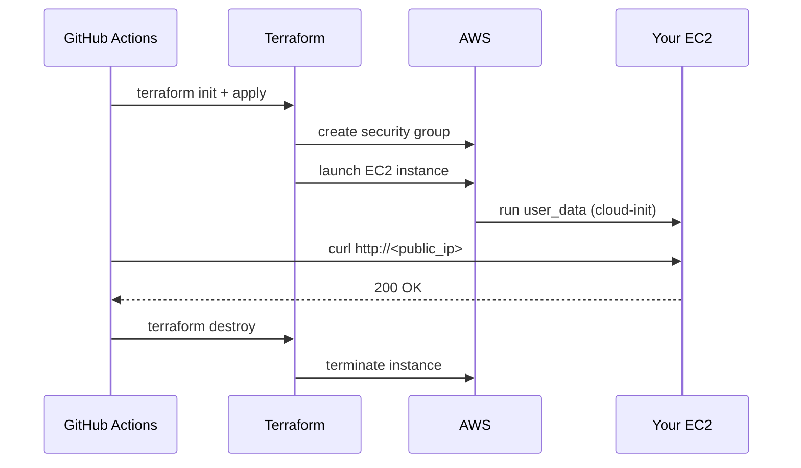

# GitHub Actions and Assignment Grading

Assignment 1 is graded automatically via GitHub Actions. This document explains what the workflow does so that if something fails, you know where to look.

---

## What is GitHub Actions

GitHub Actions is a CI/CD platform built into GitHub. You define workflows in YAML files and GitHub runs them on their infrastructure in response to events: a push, a pull request, a manual trigger. Each run gets a fresh virtual machine.

For this assignment the workflow:

1. Checks out your code
2. Provisions your EC2 instance with Terraform
3. Waits for cloud-init to finish
4. Curls your public endpoint and asserts a 200 response
5. Destroys the instance



The instance is alive for roughly 3-4 minutes per run.

---

## Setting up secrets

The workflow needs your AWS credentials to run Terraform. Store them as repository secrets -- they are masked in all logs.

Go to your repo: **Settings > Secrets and variables > Actions > New repository secret**

| Secret | Value |
|---|---|
| `AWS_ACCESS_KEY_ID` | From IAM in the AWS console |
| `AWS_SECRET_ACCESS_KEY` | From IAM in the AWS console |
| `AWS_DEFAULT_REGION` | `us-east-1` (or your region) |
| `AMI_ID` | Ubuntu 22.04 AMI ID for your region |

Do this before your first push. The workflow will fail immediately without credentials.

---

## Workflow file

Add this file to your repo at `.github/workflows/grading.yml`. Do not modify it -- the grader reads the run logs from this specific workflow.

```yaml
name: grading

on:
  push:
    branches: [main]
  workflow_dispatch:

jobs:
  provision-and-test:
    runs-on: ubuntu-latest

    steps:
      - name: Checkout
        uses: actions/checkout@v4

      - name: Setup Terraform
        uses: hashicorp/setup-terraform@v3
        with:
          terraform_wrapper: false

      - name: Terraform Init
        working-directory: ./assignment-1
        run: terraform init
        env:
          AWS_ACCESS_KEY_ID: ${{ secrets.AWS_ACCESS_KEY_ID }}
          AWS_SECRET_ACCESS_KEY: ${{ secrets.AWS_SECRET_ACCESS_KEY }}
          AWS_DEFAULT_REGION: ${{ secrets.AWS_DEFAULT_REGION }}

      - name: Terraform Apply
        working-directory: ./assignment-1
        run: terraform apply -auto-approve -var="ami_id=${{ secrets.AMI_ID }}"
        env:
          AWS_ACCESS_KEY_ID: ${{ secrets.AWS_ACCESS_KEY_ID }}
          AWS_SECRET_ACCESS_KEY: ${{ secrets.AWS_SECRET_ACCESS_KEY }}
          AWS_DEFAULT_REGION: ${{ secrets.AWS_DEFAULT_REGION }}

      - name: Get public IP
        working-directory: ./assignment-1
        id: ip
        run: echo "ip=$(terraform output -raw public_ip)" >> $GITHUB_OUTPUT
        env:
          AWS_ACCESS_KEY_ID: ${{ secrets.AWS_ACCESS_KEY_ID }}
          AWS_SECRET_ACCESS_KEY: ${{ secrets.AWS_SECRET_ACCESS_KEY }}
          AWS_DEFAULT_REGION: ${{ secrets.AWS_DEFAULT_REGION }}

      - name: Wait for cloud-init
        run: sleep 60

      - name: Test HTTP endpoint
        run: |
          curl --fail --retry 5 --retry-delay 10 http://${{ steps.ip.outputs.ip }}

      - name: Terraform Destroy
        working-directory: ./assignment-1
        if: always()
        run: terraform destroy -auto-approve -var="ami_id=${{ secrets.AMI_ID }}"
        env:
          AWS_ACCESS_KEY_ID: ${{ secrets.AWS_ACCESS_KEY_ID }}
          AWS_SECRET_ACCESS_KEY: ${{ secrets.AWS_SECRET_ACCESS_KEY }}
          AWS_DEFAULT_REGION: ${{ secrets.AWS_DEFAULT_REGION }}
```

Note the `if: always()` on the destroy step. The instance gets torn down even if the curl fails. This is intentional -- you should not end up with orphaned instances burning credits from a failed run.

---

## Reading the logs

Go to the **Actions** tab in your repo. Click any run to see its steps. Click a step to expand its output.

**Common failure points:**

- **Terraform Apply fails** -- usually a credentials issue or a misconfigured resource block. Read the apply output, it's specific about what went wrong.
- **Get public IP fails** -- your `outputs.tf` is probably missing or the output name doesn't match `public_ip`.
- **curl fails after retries** -- cloud-init didn't finish in time, or port 80 isn't open in your security group. Check that your `ingress` block includes port 80 and that your cloud-init actually installs and starts a web server.

If the curl step fails but destroy still ran, your credits are fine. Fix the issue and push again.

---

## Checking for orphaned instances

If a run gets killed mid-flight (network issue, runner timeout), destroy may not have run. After any unusual failure, check the EC2 console and terminate any running instances manually.

You can also run `terraform destroy` locally to clean up:

```bash
cd assignment-1
terraform destroy
```

This is worth doing as a habit at the end of any work session.
