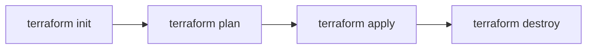

# Terraform Intro

Last week you wrote a `cloud-config` YAML and handed it to Multipass. This week that same file becomes `user_data` in a Terraform resource and AWS provisions the VM instead of your laptop. That's the whole idea.

Terraform is infrastructure-as-code. You describe what you want, Terraform figures out how to get there, and it tracks what exists in a state file. Run it again with no changes and nothing happens. That property is called idempotence, and it's why this approach scales.

---

## Install

[developer.hashicorp.com/terraform/install](https://developer.hashicorp.com/terraform/install)

Verify: `terraform version`

---

## Project layout

```
assignment-1/
├── main.tf
├── variables.tf
├── outputs.tf
├── init-mp.yaml       # your file from week 2
└── .gitignore
```

Your `.gitignore`:
```
.terraform/
*.tfstate
*.tfstate.backup
*.tfvars
```

Do not commit state files or `.tfvars`. State files can contain secrets. `.tfvars` will contain your AMI ID and region, which are environment-specific anyway.

---

## Providers

Providers are plugins that know how to talk to a platform. The AWS provider:

```hcl
terraform {
  required_providers {
    aws = {
      source  = "hashicorp/aws"
      version = "~> 5.0"
    }
  }
}

provider "aws" {
  region = var.region
}
```

---

## Resources

A resource is anything Terraform manages. The block structure is always the same:

```hcl
resource "<provider>_<type>" "<local_name>" {
  # arguments
}
```

A security group that allows inbound HTTP:

```hcl
resource "aws_security_group" "web" {
  name        = "itcc-web-sg"
  description = "Allow HTTP inbound"

  ingress {
    from_port   = 80
    to_port     = 80
    protocol    = "tcp"
    cidr_blocks = ["0.0.0.0/0"]
  }

  egress {
    from_port   = 0
    to_port     = 0
    protocol    = "-1"
    cidr_blocks = ["0.0.0.0/0"]
  }
}
```

The EC2 instance that uses it:

```hcl
resource "aws_instance" "web" {
  ami                         = var.ami_id
  instance_type               = "t3.micro"
  vpc_security_group_ids      = [aws_security_group.web.id]
  associate_public_ip_address = true
  user_data                   = file("init-mp.yaml")

  tags = {
    Name = "itcc-week3"
  }
}
```

`user_data = file("init-mp.yaml")` -- that's the same config from last week. Same file, different runtime. AWS hands it to cloud-init on first boot exactly like Multipass did.

`associate_public_ip_address = true` ensures the instance gets a public IP. Without it, the default VPC subnet may not assign one and your output will be blank.

---

## Variables

Anything environment-specific goes in `variables.tf`:

```hcl
variable "region" {
  description = "AWS region"
  type        = string
  default     = "us-east-1"
}

variable "ami_id" {
  description = "Ubuntu 24.04 LTS AMI (region-specific)"
  type        = string
}
```

Set values in `terraform.tfvars` (do not commit this file):

```hcl
region = "us-east-1"
ami_id = "ami-025d99823a4caad37"
```

AMI IDs are region-specific. Look yours up in the EC2 console under **Launch Instance > Browse AMIs**, or grab it from the CLI:

```bash
aws ec2 describe-images \
  --owners 099720109477 \
  --filters "Name=name,Values=ubuntu/images/hvm-ssd-gp3/ubuntu-noble-24.04-amd64-server-*" \
  --query 'sort_by(Images, &CreationDate)[-1].ImageId' \
  --output text \
  --region us-east-1
```

---

## Outputs

Outputs expose values after apply. You need the public IP to hit your instance:

```hcl
output "public_ip" {
  value = aws_instance.web.public_ip
}
```

After `terraform apply` completes, this prints to the terminal. You can also run `terraform output public_ip` at any time.

---

## The workflow



| Command | What it does |
|---|---|
| `terraform init` | Downloads the provider plugin. Run once per project. |
| `terraform plan` | Shows what will change. Read this before applying. |
| `terraform apply` | Creates or updates resources. Prompts for confirmation. |
| `terraform destroy` | Tears everything down. Run this when you're done. |

```bash
terraform init
terraform plan
terraform apply

# when you're finished:
terraform destroy
```

`terraform plan` before every apply is a good habit. It's easy to catch mistakes there versus after the fact in the console.

---

## Credentials

Terraform reads AWS credentials from environment variables:

```bash
export AWS_ACCESS_KEY_ID="your-key-id"
export AWS_SECRET_ACCESS_KEY="your-secret"
export AWS_DEFAULT_REGION="us-east-1"
```

Generate these from the IAM console. Do not paste them into any `.tf` file and do not commit them anywhere. We'll revisit how credentials should actually work in week 7.

---

## Remote state

By default Terraform writes state to a local `terraform.tfstate` file. That's fine on your laptop, but the GitHub Actions grader runs in a fresh VM every time -- local state doesn't survive between runs. If the runner dies mid-apply, Terraform loses track of what it created and those resources sit in your account with nothing managing them.

The fix is an S3 backend. State lives in a bucket, survives runner death, and is always available regardless of where `terraform` runs from.

**Step 1: Create the bucket**

Do this once, manually. Terraform can't manage the bucket that stores its own state.

```bash
aws s3api create-bucket \
  --bucket itcc-tfstate-<your-pitt-username> \
  --region us-east-1
```

If you're using a region other than `us-east-1`, add `--create-bucket-configuration LocationConstraint=<your-region>`.

Enable versioning so you can recover a previous state file if something goes wrong:

```bash
aws s3api put-bucket-versioning \
  --bucket itcc-tfstate-<your-pitt-username> \
  --versioning-configuration Status=Enabled
```

**Step 2: Add the backend block**

In your `terraform` block in `main.tf`:

```hcl
terraform {
  backend "s3" {
    bucket = "itcc-tfstate-<your-pitt-username>"
    key    = "assignment-1/terraform.tfstate"
    region = "us-east-1"
  }

  required_providers {
    aws = {
      source  = "hashicorp/aws"
      version = "~> 5.0"
    }
  }
}
```

**Step 3: Re-init**

```bash
terraform init
```

Terraform will detect the new backend and ask if you want to migrate existing local state to S3. Say yes. After that, `terraform.tfstate` on disk is no longer the source of truth -- S3 is.

The bucket name needs to be globally unique. `itcc-tfstate-<your-pitt-username>` is a reasonable convention.

---

## Putting it together

Your `main.tf` needs to combine everything from the sections above:

- the S3 backend block (with your bucket name)
- the AWS provider
- a security group that allows HTTP inbound
- an EC2 instance that uses the security group and your cloud-init file as user data
- an output that exposes the public IP

Once you have it wired up:

```bash
terraform init
terraform plan
terraform apply
curl http://$(terraform output -raw public_ip)
terraform destroy
```

If the curl returns your web server response, you're done.
