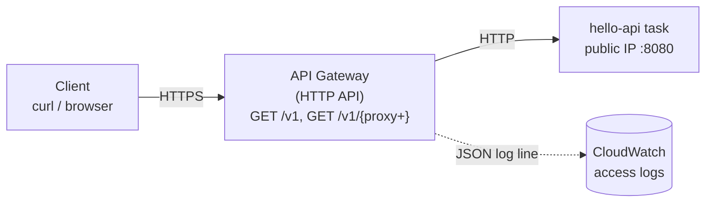

# Week 6: REST + API Gateway

The first half of class finishes the Week 5 ECS material and Fargate demo (see `week-05/`). The Week 6 deck covers REST principles and API Gateway. This demo puts a managed HTTPS front door on the `hello-api` Fargate task from that demo.

## 01-api-gateway

An HTTP API with two `GET` routes, a tiny throttle (burst 2, 1 req/s), and JSON access logs in CloudWatch.



### Run it

Leave the Week 5 Fargate stack running and grab the task's public IP (Week 5's `task-ip.sh`).

```bash
cd week-06/api-gateway
terraform init
terraform apply -var "backend_url=http://<task-ip>:8080"
terraform output try_it
```

No task running? Point it at an echo service instead. It also shows the headers API Gateway adds on the way through:

```bash
terraform apply -var "backend_url=https://httpbin.org/anything"
```

### What to show

| Step | Command | Expect |
|---|---|---|
| Front door works | `curl -i $URL/v1` | `200`, same JSON as the task, now over HTTPS |
| No route | `curl -i $URL/nope` | `404 {"message":"Not Found"}` from the gateway, the task never sees it |
| Wrong method | `curl -i -X DELETE $URL/v1` | `404` too: HTTP APIs do not return `405` |
| Throttle | `./hammer.sh $URL/v1 30` | a few `200`, many `429` |
| Logs | `aws logs tail /apigw/cs1660-w6-front-door --follow` | one JSON line per request, `routeKey` and `integrationStatus` included |
| Break it | `aws ecs stop-task --cluster <cluster> --task <id>` | the service starts a replacement with a **new IP**; the gateway now returns `504` after 5 s |

The last step is the point of the demo: a task IP is not an address you can publish. The fix is an ALB with a stable DNS name, reached privately through a VPC Link (slides only, not built live).

### Clean up

```bash
terraform destroy -var "backend_url=http://unused"
```

Then destroy the Week 5 Fargate stack as well. API Gateway costs nothing when idle, but the Fargate task bills by the second.
